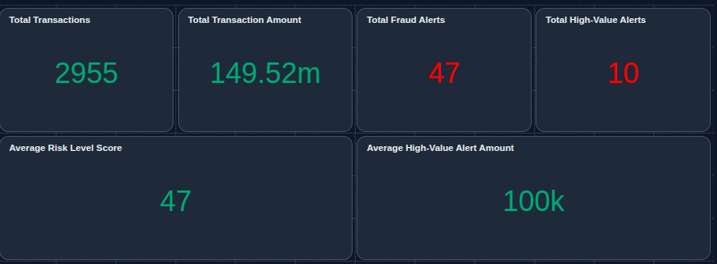

# FinGuard: Real-Time Financial Fraud Detection & Streaming Lakehouse

FinGuard is an end-to-end, production-grade real-time financial fraud detection and monitoring platform built on the Databricks Lakehouse architecture. The platform ingests live credit-card transaction events from **Confluent Cloud Kafka**, enriches them with batch-loaded master customer profiles from **PostgreSQL (Neon DB)**, and cross-references semi-structured fraud watchlist files ingested via **Databricks Auto Loader**. All data flows through a multi-hop Medallion pipeline (Bronze → Silver → Gold) implemented as a **Lakeflow Spark Declarative Pipeline (SDP)**, with stateful stream-stream joins, event-time watermarking, and DLT data-quality expectations. When fraud is detected—either a transaction exceeding a customer's configured limit or a watchlist card-number hit—FinGuard dispatches real-time HTML email alerts via Gmail SMTP, with credentials secured in Databricks Secrets. A live AI/BI dashboard provides operational monitoring of fraud trends, transaction distributions, and alert details.

## Table of Contents

* [Technologies Used](#technologies-used)
* [Prerequisites](#prerequisites)
* [Setup Instructions](#setup-instructions)
* [Architecture Overview](#architecture-overview)
* [FinGuard Real-Time Monitoring Dashboard](#finguard-real-time-monitoring-dashboard)
* [Directory Structure](#directory-structure)
* [Key Learning Outcomes](#key-learning-outcomes)
* [Future Enhancements](#future-enhancements)
* [Production Features & Operational Diagnostics](#production-features--operational-diagnostics)
* [Project Structure Highlights](#project-structure-highlights)
* [License](#license)
* [Contact](#contact)

---

## Technologies Used

* **Cloud Platform**: Databricks Lakehouse
* **Streaming**: Apache Spark Structured Streaming, Confluent Cloud Kafka
* **Data Pipeline**: Lakeflow Spark Declarative Pipelines (SDP), Delta Live Tables (DLT)
* **Database**: PostgreSQL (Neon DB)
* **Storage**: Unity Catalog, Delta Lake, UC Volumes
* **Data Ingestion**: Databricks Auto Loader (cloudFiles), Kafka readStream
* **Data Quality**: DLT Expectations (@expect, @expect_or_drop)
* **Programming**: Python, SQL, PySpark
* **Visualization**: Databricks AI/BI Dashboard (Lakeview)
* **Monitoring**: Real-time alerting via Gmail SMTP
* **Security**: Databricks Secrets, SASL_SSL encryption

---

## FinGuard Real-Time Monitoring Dashboard

The FinGuard dashboard provides real-time visibility into fraud alerts, transaction volumes, and geographic distributions. All screenshots are stored in the `./assets` directory.

### Pipeline Architecture


*End-to-end SDP pipeline graph showing Bronze, Silver, and Gold layer dependencies across Kafka streaming, Auto Loader, and batch customer ingestion sources.*

### Transaction Fraud Metrics Overview



*Top-level dashboard canvas aggregating fraud alert counts, transaction volume metrics, and geographic breakdowns.*

### Hourly Fraud Alert Trend


*Time-series chart tracking fraud alert volume by hour, enabling analysts to spot anomaly spikes in real time.*

### Fraud Alert Details


*Detailed breakdown of individual fraud alerts including alert type, risk level, watchlist match metadata, and transaction context.*

### Top 10 Merchants by Transaction Count


*Bar chart ranking the top 10 merchants by total transaction volume processed through the pipeline.*

### Top 10 Categories by Transaction Amount


*Bar chart showing the top 10 merchant categories ranked by aggregate transaction amount.*

### Transaction Distribution by Country


*Geographic distribution of transactions across countries, visualised as a world map widget.*

### Transaction Distribution by City


*Geographic distribution of transactions across cities, visualised as a map widget with volume-based colour scaling.*

---

## Architecture Overview

```
┌─────────────────────────────────────────────────────────────────────────────────────┐
│                              DATA SOURCES                                            │
│                                                                                     │
│  ┌──────────────────────┐   ┌──────────────────────┐   ┌────────────────────────┐  │
│  │  kafka_producer/      │   │  Postgres_SQL/        │   │ Fraud_watchlist_file_  │  │
│  │  (Python producers)   │   │  (Neon DB / Postgres) │   │ generator/             │  │
│  │                       │   │                       │   │                        │  │
│  │  Confluent Kafka      │   │  Master customer      │   │  Semi-structured JSON  │  │
│  │  SASL_SSL + Idempotent│   │  profiles (batch)     │   │  watchlist files        │  │
│  └──────────┬───────────┘   └──────────┬────────────┘   └───────────┬────────────┘  │
│             │                          │                            │               │
│             ▼                          ▼                            ▼               │
└─────────────────────────────────────────────────────────────────────────────────────┘
                                    │
              ══════════════════════╪══════════════════════
              ▼                     ▼                        ▼
┌─────────────────────────────────────────────────────────────────────┐
│                      BRONZE LAYER (Raw Persistence)                  │
│                                                                     │
│  ┌──────────────────────────┐  ┌──────────────────────────────────┐ │
│  │ transactions_bronze.py   │  │ fraud_watchlist_bronze.py        │ │
│  │                          │  │                                  │ │
│  │ Kafka readStream         │  │ Auto Loader (cloudFiles)         │ │
│  │ Persists: key, value,    │  │ Reads JSON from UC Volume:      │ │
│  │ topic, partition, offset,│  │ /Volumes/finguard/source/       │ │
│  │ timestamp, timestampType│  │   fraud_watchlist/source_data/  │ │
│  │ + ingestion_timestamp    │  │ Captures: _rescued_data,        │ │
│  │                          │  │   _metadata.file_path           │ │
│  └──────────┬───────────────┘  └──────────────┬───────────────────┘ │
│             │                                  │                    │
│  ┌──────────┴───────────────────────────────────┴──────────────────┐│
│  │  customers_bronze (batch ingest from Neon DB Postgres)          ││
│  │  Historic + incremental CDC loads                              ││
│  └──────────┬────────────────────────────────────────────────────┘│
└─────────────┼────────────────────────────────────────────────────────┘
              │
              ▼
┌─────────────────────────────────────────────────────────────────────┐
│                    SILVER LAYER (Parsed & Validated)                 │
│                                                                     │
│  ┌────────────────────────────┐  ┌────────────────────────────────┐ │
│  │ transactions_silver.py     │  │ fraud_watchlist_silver.py       │ │
│  │                            │  │                                │ │
│  │ StructType JSON schema     │  │ Structured watchlist columns   │ │
│  │ parsing via from_json()    │  │ with effective_from timestamp  │ │
│  │                            │  │                                │ │
│  │ DLT Expectations:           │  │ DLT Expectations:              │ │
│  │  @expect_or_drop            │  │  @expect_or_drop               │ │
│  │   - valid_transaction_id    │  │   - valid_watchlist_id         │ │
│  │   - valid_customer_id       │  │   - valid_entity_id            │ │
│  │   - valid_card_number       │  │                                │ │
│  │   - valid_merchant_id       │  │                                │ │
│  │  @expect                    │  │                                │ │
│  │   - valid_amount > 1000     │  │                                │ │
│  │                            │  │                                │ │
│  │ Retains Kafka lineage:      │  │                                │ │
│  │  kafka_topic, partition,   │  │                                │ │
│  │  offset, kafka_timestamp    │  │                                │ │
│  └──────────┬─────────────────┘  └──────────────┬─────────────────┘ │
│             │                                     │                  │
│  ┌──────────┴────────────────────────────────────┴───────────────┐ │
│  │  customers_silver (customers_load_to_silver.py)                │ │
│  │  DLT Expectations:                                             │ │
│  │   - valid_customer_id, valid_card_number, valid_email         │ │
│  │  Enriched with transaction_limit, risk_score, card_type       │ │
│  └──────────┬────────────────────────────────────────────────────┘ │
└─────────────┼────────────────────────────────────────────────────────┘
              │
              ▼
┌─────────────────────────────────────────────────────────────────────┐
│                     GOLD LAYER (Fraud Detection)                     │
│                                                                     │
│  ┌──────────────────────────────┐  ┌──────────────────────────────┐ │
│  │ high_value_transactions_     │  │ fraud_card_alert.py           │ │
│  │ alert.py                     │  │                              │ │
│  │                              │  │ Stream-stream join:           │ │
│  │ Stream-static join:          │  │  transactions ⋈ fraud_watch- │ │
│  │  transactions ⋈ customers    │  │  list on card_number ==       │ │
│  │  WHERE amount >              │  │  entity_id                    │ │
│  │  transaction_limit           │  │                              │ │
│  │                              │  │ Event-time watermark: 5 min   │ │
│  │ Alert type:                  │  │ on transaction_timestamp &    │ │
│  │  HIGH_VALUE_TRANSACTION      │  │ effective_from               │ │
│  │                              │  │                              │ │
│  │                              │  │ Alert type:                  │ │
│  │                              │  │  FRAUD_WATCHLIST_MATCH        │ │
│  └──────────┬───────────────────┘  └──────────────┬───────────────┘ │
│             │                                       │                │
│  ┌──────────┴───────────────────────────────────────┴──────────────┐│
│  │  transaction_count_by_minute.py           (tumbling window)    ││
│  │  transaction_count_by_minute_sliding_window.py (sliding window) ││
│  │  Windowed aggregations with 5-min watermark                     ││
│  └────────────────────────────────────────────────────────────────┘│
└─────────────┬────────────────────────────────────────────────────────┘
              │
              ▼
┌─────────────────────────────────────────────────────────────────────┐
│                    DOWNSTREAM ACTIONS                               │
│                                                                     │
│  ┌──────────────────────────────┐  ┌──────────────────────────────┐ │
│  │  Email Alerts (Gmail SMTP)   │  │  FinGuard Real-Time          │ │
│  │                               │  │  Monitoring Dashboard         │ │
│  │  foreach_batch_sink:          │  │  (AI/BI Lakeview)            │ │
│  │   - high_value_alert emails   │  │                              │ │
│  │   - fraud_card_alert emails   │  │  Widgets:                    │ │
│  │                               │  │   - Fraud alert details      │ │
│  │  Credentials via              │  │   - Hourly fraud trends     │ │
│  │  dbutils.secrets.get(         │  │   - Transaction distributions│ │
│  │    "finguard-scope",          │  │   - Top merchants/categories │ │
│  │    "gmail_api_key")           │  │                              │ │
│  └──────────────────────────────┘  └──────────────────────────────┘ │
└─────────────────────────────────────────────────────────────────────┘
```

---

## Directory Structure

```
Fraud_detection/
├── assets/                                      # Dashboard and pipeline screenshots for README
├── finguard_customers_silver_load/              # Batch customer profile ingestion (Neon DB → Silver)
│   └── silver/
│       └── customers_load_to_silver.py         # SDP table: parses bronze customers with DLT expectations
├── finguard_streaming/                          # Core streaming pipeline (Bronze → Silver → Gold + Alerts)
│   ├── Bronze/
│   │   ├── transactions_bronze.py               # Kafka readStream → raw transaction persistence
│   │   └── fraud_watchlist_bronze.py            # Auto Loader (cloudFiles) → raw watchlist persistence
│   ├── Silver/
│   │   ├── transactions_silver.py               # StructType JSON parsing + DLT expectations + Kafka lineage
│   │   └── fraud_watchlist_silver.py            # Structured watchlist with effective_from timestamps
│   ├── Gold/
│   │   ├── high_value_transactions_alert.py     # Stream-static join: amount > customer transaction_limit
│   │   ├── fraud_card_alert.py                  # Stream-stream join: card_number == watchlist entity_id
│   │   ├── transaction_count_by_minute.py       # Tumbling window aggregation (1-min window, 5-min watermark)
│   │   └── transaction_count_by_minute_sliding_window.py  # Sliding window (5-min window, 1-min slide)
│   └── email alerts/
│       ├── high_value_transaction_alerts.py    # foreach_batch_sink: Gmail SMTP for high-value alerts
│       └── fraud_card_alert_email_notifier.py  # foreach_batch_sink: Gmail SMTP for fraud watchlist alerts
├── Fraud_watchlist_file_generator/              # Generates semi-structured JSON watchlist files
│   ├── fraud_watchlist_data_generator           # Notebook: produces watchlist entities (cards, merchants)
│   └── fraud_watchlist.csv                      # Sample watchlist CSV reference data
├── kafka_producer/                              # Python Kafka producer suite for Confluent Cloud
│   ├── config.py                                # Dataclass-based settings loaded from .env
│   ├── producer_normal.py                       # Idempotent producer for legitimate transactions
│   ├── producer_fraud_transaction.py            # Producer injecting fraud-pattern transactions
│   ├── producer_fraud_card.py                   # Producer generating watchlist-card-number transactions
│   ├── transaction_generator.py                 # Transaction event factory with fraud injection
│   ├── customer_generator.py                    # Synthetic customer profile generator
│   ├── merchant_generator.py                    # Synthetic merchant master data generator
│   ├── fraud_engine.py                          # Fraud scoring and pattern injection logic
│   ├── models.py                                 # Dataclass models for transactions, customers, merchants
│   ├── utils.py                                  # JSON payload validation utilities
│   ├── update_csv_email.py                       # CSV email updater for customer profiles
│   ├── consumer.py                               # Kafka consumer for local testing/validation
│   ├── requirements.txt                          # Python dependencies (confluent-kafka, python-dotenv)
│   ├── data/                                     # Generated CSV reference data (customers, merchants)
│   └── README.md                                 # Kafka producer setup and usage instructions
├── Postgres_SQL/                                # PostgreSQL (Neon DB) DDL and seed data
│   ├── customers_historic.sql                    # Full-load DDL + INSERT for 1,000 customer profiles
│   └── customers_incremental.sql                 # Incremental CDC load DDL + INSERT for new/updated customers
├── .gitignore                                   # Git ignore rules (secrets, .env, data files)
├── Autoloader_test.py                            # Standalone notebook: Auto Loader PoC for watchlist JSON
├── Credentials                                   # Notebook: Databricks Secrets scope setup (Kafka, Gmail)
├── Kafka_streaming_test                          # Notebook: Kafka streaming readStream PoC and validation
├── query test                                    # Notebook: ad-hoc SQL queries for Gold-layer validation
└── README.md                                    # This file
```

---

## Production Features & Operational Diagnostics

### Event-Time Watermarking for Bounded State in Stream-Stream Joins

The Gold-layer `fraud_card_alert` table performs a **stream-stream inner join** between live transactions and the fraud watchlist stream, joining on `card_number == entity_id`. In Structured Streaming, unbounded stream-stream joins can cause RocksDB state-store memory to grow indefinitely because the engine must buffer rows from both sides until a match arrives. FinGuard solves this by applying **event-time watermarks** to both sides of the join:

```python
# transactions side — 5-minute watermark on transaction_timestamp
transactions_with_watermark = transactions.withWatermark("transaction_timestamp", "5 minutes")

# fraud watchlist side — 5-minute watermark on effective_from
fraud_watchlist_with_watermark = fraud_watchlist.withWatermark("effective_from", "5 minutes")
```

The watermark tells the engine that no event with an event-time older than `max_event_time - 5 minutes` will arrive. Once the watermark advances past a row's event time, that row is evicted from the RocksDB state store. This bounds the state to roughly a 5-minute window of late-arriving data, keeping memory usage predictable and preventing unbounded state growth during long-running streaming jobs. The 5-minute threshold was chosen to accommodate network and processing latency from Confluent Cloud Kafka while still providing timely fraud alerts.

The same watermarking pattern is applied to the Gold-layer windowed aggregations (`transaction_count_by_minute` and `transaction_count_by_minute_sliding_window`), ensuring that tumbling and sliding window state is also garbage-collected after the watermark passes the window end.

### Confluent Kafka Idempotent Producer with SASL_SSL Authentication

The `kafka_producer/` suite connects to **Confluent Cloud Kafka** using the `confluent-kafka` Python client with the following production-grade settings:

```python
config = {
    "bootstrap.servers": settings.bootstrap_servers,
    "security.protocol": "SASL_SSL",
    "sasl.mechanisms": "PLAIN",
    "sasl.username": settings.api_key,
    "sasl.password": settings.api_secret,
    "client.id": "credit-card-stream-simulator-normal",
    "acks": "all",                # Wait for all in-sync replicas to acknowledge
    "retries": 5,                  # Retry on transient failures
    "retry.backoff.ms": 500,       # 500ms backoff between retries
    "enable.idempotence": True,    # Exactly-once delivery within a producer session
}
```

Key design decisions:

* **SASL_SSL + PLAIN**: All traffic to Confluent Cloud is encrypted in transit (TLS) and authenticated via Confluent Cloud API key/secret. No credentials are hardcoded — they are loaded from a `.env` file via `python-dotenv`.
* **`enable.idempotence: True`**: Ensures that retried produces do not create duplicate messages in the Kafka topic. Combined with `acks: all`, this provides exactly-once delivery semantics within a single producer session, which is critical for financial transaction streams where duplicate events could trigger false fraud alerts.
* **`retries: 5` with `retry.backoff.ms: 500`**: Provides resilience against transient broker errors without blocking the producer indefinitely.

On the Databricks consumer side (Bronze layer), the Kafka connection details (bootstrap servers, API key, API secret, topic) are retrieved at runtime from Databricks Secrets:

```python
kafka_connection_json = dbutils.secrets.get(scope="finguard-scope", key="kafka_connection_details")
kafka_config = json.loads(kafka_connection_json)
```

The JAAS configuration for SASL/PLAIN is constructed dynamically from the secret payload, ensuring that no credentials are exposed in source code or pipeline logs.

### Triage Partition Offset Lag on the Bronze Table

When the streaming pipeline falls behind, you can quickly diagnose which Kafka partitions are lagging by querying the Bronze table directly. The Bronze layer persists `kafka_partition`, `kafka_offset`, and `kafka_timestamp` for every ingested record, enabling offset-based lag analysis without external monitoring tools.

```sql
-- Identify the highest offset consumed per partition and detect lag
SELECT
    kafka_partition,
    MAX(kafka_offset)                       AS max_offset_consumed,
    MAX(kafka_timestamp)                    AS last_message_timestamp,
    MAX(ingestion_timestamp)                AS last_ingestion_timestamp,
    CURRENT_TIMESTAMP() - MAX(kafka_timestamp) AS kafka_lag_duration,
    COUNT(*)                                AS total_messages_ingested
FROM finguard.bronze.transactions
GROUP BY kafka_partition
ORDER BY kafka_partition;
```

| Column | Description |
| --- | --- |
| `kafka_partition` | The Kafka topic partition number |
| `max_offset_consumed` | Highest offset consumed per partition — compare against the Kafka broker's log-end offset to calculate lag |
| `last_message_timestamp` | Timestamp of the most recent Kafka message per partition |
| `last_ingestion_timestamp` | Databricks ingestion timestamp — compare against `last_message_timestamp` to measure processing delay |
| `kafka_lag_duration` | Wall-clock duration between the latest Kafka message and the current time — a growing value indicates the consumer is falling behind |
| `total_messages_ingested` | Total row count per partition — useful for detecting imbalanced partition assignment |

If `kafka_lag_duration` grows over time for specific partitions, investigate topic partition skew, inadequate streaming trigger intervals, or insufficient cluster resources. The `total_messages_ingested` column helps identify partitions receiving disproportionate traffic from the producer.

---

## Project Structure Highlights

* **Separation of Concerns**: Clear separation between data generation (producers), ingestion (Bronze), transformation (Silver), and business logic (Gold)
* **Testability**: Standalone notebooks (`Kafka_streaming_test`, `Autoloader_test`) for component-level validation
* **Observability**: Kafka lineage metadata (partition, offset, timestamp) persisted at Bronze layer for debugging and lag analysis
* **Idempotency**: Kafka producer idempotence and Delta Lake ACID guarantees ensure exactly-once delivery semantics
* **Security First**: No hardcoded credentials — all secrets managed via Databricks Secrets and environment variables

---

## License

This project is available as a portfolio demonstration. Feel free to use and modify for learning purposes.

---

## Contact

Built as a data engineering portfolio project demonstrating real-time streaming, lakehouse architecture, and production-grade data quality patterns.

For questions or collaboration opportunities, connect via:

* **LinkedIn**: [linkedin.com/in/ankitbisht007](https://www.linkedin.com/in/ankitbisht007/)
* **GitHub**: Check out more projects in my repositories