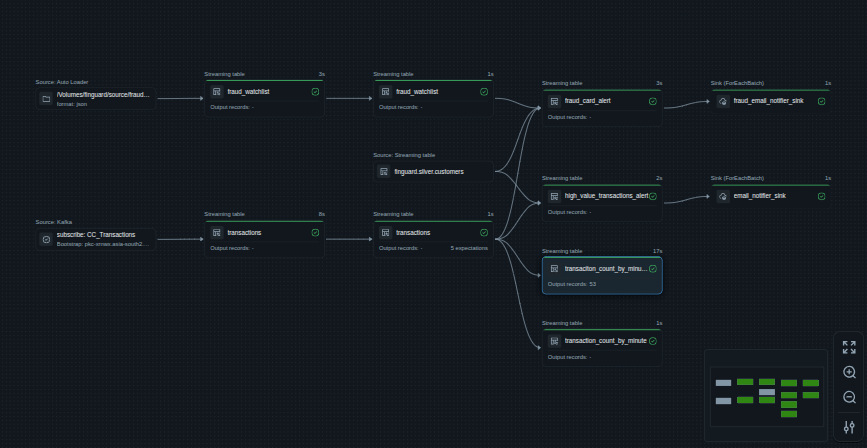

# Fraud Detection System

A comprehensive fraud detection solution built with **Databricks**, **Kafka**, and **PostgreSQL** for real-time credit card transaction monitoring and fraud watchlist management.

## 📋 Project Overview

This project implements an end-to-end fraud detection platform that processes credit card transactions in real-time, identifies suspicious patterns, and maintains a watchlist of fraudulent activities. The system integrates multiple data sources including PostgreSQL customer databases and Kafka streaming transactions, leveraging:

- **PostgreSQL**: Source system for customer master data and fraud detection logic
- **Kafka**: Real-time streaming of credit card transactions
- **Databricks**: Data processing, transformation, and ML models
- **Delta Lake**: Unified data lakehouse architecture (Bronze, Silver, Gold layers)

## 🏗️ Architecture

### Tech Stack
- **Primary Language**: PLpgSQL (73%) - PostgreSQL stored procedures, functions, and data ingestion logic
- **Data Processing**: Python (20%) - PySpark/Databricks notebooks and ETL jobs
- **Analytics & Testing**: Jupyter Notebooks (7%)

## 📁 Project Structure

```
Fraud_detection/
├── README.md                                   # Project documentation (this file)
├── Credentials.ipynb                           # Databricks credential setup and secret management
├── Kafka_streaming_test.ipynb                  # Kafka streaming pipeline testing
├── Autoloader_test.py.ipynb                    # Data autoloader configuration testing
├── query test.ipynb                            # SQL query testing
│
├── FinGuard Real-time Monitoring Dashboard.lvdash.json  # AI/BI Dashboard for real-time monitoring
│
├── assets/                                     # Documentation assets
│   ├── finguard_dashboard_snapshot.png         # Dashboard screenshot
│   └── pipeline_architecture.png               # Pipeline architecture diagram
│
├── Postgres_SQL/                               # PostgreSQL stored procedures and functions
│   └── [Customer data extraction and fraud detection rules]
│
├── kafka_producer/                             # Kafka producer implementations
│   └── [Producer configurations and scripts]
│
├── finguard_streaming/                         # Streaming data pipeline
│   └── [Kafka to Delta Lake streaming jobs]
│
├── finguard_customers_silver_load/             # Customer data transformation (Bronze → Silver)
│   └── [PostgreSQL to Bronze, Bronze to Silver data pipeline]
│
├── Fraud_watchlist_file_generator/             # Watchlist generation
│   └── [Fraud watchlist creation and updates]
│
└── .gitignore                                  # Git ignore rules
```

## 🎯 Key Features

### 1. **PostgreSQL Customer Data Integration**
- Extract customer master data from PostgreSQL source system
- Ingest customer data into Bronze layer (raw data)
- Transform and enrich customer data in Silver layer
- Support for customer profiles, demographics, and behavioral attributes

### 2. **Real-Time Streaming**
- Kafka-based streaming of credit card transactions from Confluent Cloud
- SASL/SSL authentication for secure data transmission
- Configurable topic subscription and partition handling
- Parallel processing of batch and streaming transactions

### 3. **Databricks Integration**
- Multi-layer data lakehouse (Bronze, Silver, Gold)
- Batch and streaming processing capabilities
- Automated data ingestion using Autoloader (cloudFiles)
- Delta Lake tables for ACID transactions and versioning
- Support for both structured and unstructured data

### 4. **Fraud Detection Components**
- **Synthetic Fraud Watchlist Generator** - Automated generation of fraud watchlist records with resume capability
- Customer data enrichment and deduplication
- Transaction data ingestion and processing
- Fraud watchlist management and real-time matching
- Real-time anomaly detection based on customer behavior
- Historical fraud pattern analysis and scoring
- Auto Loader for continuous ingestion of watchlist updates

### 5. **Credential Management**
- Secure secret storage using Databricks Secret Scopes
- Support for Kafka credentials, PostgreSQL connection strings, and API keys
- Centralized credential management for all integrations

## 📊 Real-Time Monitoring Dashboard

### **FinGuard Real-time Monitoring Dashboard**

A comprehensive Databricks AI/BI dashboard providing real-time visibility into fraud detection operations, transaction patterns, and alert monitoring.


*Screenshot: FinGuard Real-time Monitoring Dashboard - Real-time fraud detection metrics and analytics*

### **Pipeline Architecture**


*Figure: Complete data pipeline architecture showing the flow from source data through Bronze, Silver, and Gold layers*

The pipeline architecture diagram above illustrates the complete end-to-end data flow:

**Source Data Ingestion**:
* **Watchlist Data Generator** - Generates synthetic fraud watchlist records and streams them as JSON files
* **PostgreSQL (Customers)** - Extracts customer master data via JDBC
* **Kafka (CC_Transactions)** - Real-time credit card transaction stream

**Bronze Layer** - Raw data ingestion with full fidelity:
* `fraud_watchlist` - Ingested watchlist records
* `targeted_silver.customers` - Raw customer data
* `transactions` - Raw transaction data

**Silver Layer** - Cleaned, enriched, and deduplicated data:
* `fraud_card_alert` - Processed fraud card alerts
* `high_value_transactions_alert` - High-value transaction alerts
* `transactions_count_by_merch...` - Aggregated transaction metrics

**Gold Layer** - Analytics-ready business metrics:
* `fraud_email_notifier_sink` - Email notification queue for fraud alerts
* `email_notifier_sink` - General email notification system

#### Dashboard Overview

The FinGuard dashboard offers a single-pane view of the entire fraud detection system, aggregating data from Bronze, Silver, and Gold layers to provide actionable insights.

**Dashboard Link**: [FinGuard Real-time Monitoring Dashboard](#dashboard-987890355154191)

#### Key Metrics (KPIs)

The dashboard tracks six critical performance indicators updated in real-time:

* **Total Transactions** - Volume of credit card transactions processed in the last 7 days
* **Total Transaction Amount** - Aggregate monetary value of all transactions
* **Total Fraud Alerts** - Count of fraud alerts triggered by the detection system
* **Total High-Value Alerts** - Number of high-value transaction alerts requiring review
* **Average Risk Level Score** - Mean risk score across all fraud alerts
* **Average High-Value Alert Amount** - Mean transaction amount for high-value alerts

#### Visualizations

The dashboard includes 13 interactive widgets organized for comprehensive monitoring:

**Transaction Analytics**
* **Top 10 Merchants by Transaction Count** (Bar Chart) - Identifies highest-volume merchants
* **Top 10 Categories by Transaction Amount** (Bar Chart) - Shows spending distribution across merchant categories
* **Transaction Distribution by Country** (Pie Chart) - Geographic spread of transactions
* **Transaction Distribution by City** (Pie Chart) - City-level transaction heatmap
* **Hourly Transaction Volume Trend** (Line Chart) - Real-time transaction flow patterns

**Fraud Detection Monitoring**
* **Fraud Alert Details** (Table) - Detailed view of all fraud alerts with card numbers, amounts, risk levels, and reason codes
* **Hourly Fraud Alert Trend** (Line Chart) - Time-series visualization of fraud alert frequency

#### Data Sources

The dashboard queries four primary datasets from the Databricks lakehouse:

1. **Transactions (Last 7 Days)** - `finguard.silver.transactions`
   - Real-time credit card transaction data
   - Fields: transaction_id, customer_id, card_number, merchant details, amount, location, timestamp

2. **Fraud Alerts (Last 7 Days)** - `finguard.gold.fraud_card_alert`
   - Fraud detection system alerts
   - Fields: alert_id, card_number, amount, risk_level, reason_code, alert_timestamp

3. **High-Value Alerts (Last 7 Days)** - `finguard.gold.high_value_transactions_alert`
   - Alerts for unusually large transactions
   - Fields: alert_id, customer_id, transaction_amount, alert_timestamp

4. **All Customers** - `finguard.silver.customers`
   - Customer master data and segmentation
   - Fields: customer_id, customer_segment

#### Use Cases

* **Real-Time Monitoring**: Track transaction flow and fraud alerts as they occur
* **Pattern Analysis**: Identify merchant and category trends that may indicate fraud
* **Geographic Risk Assessment**: Monitor transaction distribution across countries and cities
* **Alert Investigation**: Drill down into fraud alert details for investigation
* **Performance Tracking**: Measure fraud detection system effectiveness through KPIs
* **Operational Dashboards**: Enable fraud analysts and operations teams to respond quickly

#### Technical Features

* **Auto-Refresh**: Dashboard updates automatically to reflect latest data
* **7-Day Lookback Window**: Focuses on recent activity for actionable insights
* **Hourly Aggregation**: Trend charts show patterns at hourly granularity
* **Interactive Filters**: Drill-down capabilities for detailed analysis
* **Unity Catalog Integration**: Direct querying of Delta Lake tables

## 🔍 Fraud Watchlist Data Generator

### **Synthetic Watchlist Generation System**

The Fraud Watchlist Data Generator is a critical component that creates and maintains a continuously updated fraud watchlist for real-time matching against incoming transactions.

**Location**: `Fraud_watchlist_file_generator/`

### Components

**1. Fraud Watchlist Data Generator Notebook** (`fraud_watchlist_data_generator.ipynb`)

A Python notebook that generates synthetic fraud watchlist records and streams them as JSON files to simulate real-world fraud intelligence updates.

**Key Features**:
* **CSV-to-JSON Conversion** - Reads fraud watchlist records from a master CSV file
* **Incremental Processing** - Smart resume capability that tracks the last processed record
* **Time-Stamped Output** - Each record is written as a separate JSON file with unique timestamp
* **Simulated Real-Time Streaming** - 5-second delay between files to mimic continuous data arrival
* **Unity Catalog Volume Integration** - Writes directly to `/Volumes/finguard/source/fraud_watchlist/source_data/`
* **Idempotent Processing** - Scans existing files to avoid duplicates and resume from last position

**2. Master Watchlist Data** (`fraud_watchlist.csv`)

A CSV file containing the master fraud watchlist records with the following structure:
* `watchlist_id` - Unique identifier for each watchlist entry (e.g., WL000001)
* `entity_id` - Card number, customer ID, or merchant ID flagged as fraudulent
* `entity_type` - Type of entity (card, customer, merchant)
* `risk_level` - Risk classification (HIGH, MEDIUM, LOW)
* `reason_code` - Reason for watchlist inclusion
* `date_added` - Timestamp when the entity was added to the watchlist
* Additional metadata fields for fraud investigation

### How It Works

```
┌──────────────────────────────────────────────────────┐
│  fraud_watchlist.csv                                  │
│  (Master watchlist with 1000s of records)             │
└────────────────────┬─────────────────────────────────┘
                     │
                     ↓
┌──────────────────────────────────────────────────────┐
│  fraud_watchlist_data_generator Notebook             │
│  ├─ Reads CSV file                                    │
│  ├─ Checks for existing JSON files                   │
│  ├─ Resumes from last processed watchlist_id         │
│  └─ Converts each row to JSON                        │
└────────────────────┬─────────────────────────────────┘
                     │
                     ↓ (One JSON file per row)
┌──────────────────────────────────────────────────────┐
│  Unity Catalog Volume                                │
│  /Volumes/finguard/source/fraud_watchlist/           │
│  source_data/                                         │
│  ├─ fraud_watchlist_20240101_123456_000001_0.json   │
│  ├─ fraud_watchlist_20240101_123501_000002_1.json   │
│  └─ fraud_watchlist_...                              │
└────────────────────┬─────────────────────────────────┘
                     │
                     ↓ (Auto Loader monitors this path)
┌──────────────────────────────────────────────────────┐
│  Bronze Layer: fraud_watchlist_bronze                │
│  (Auto Loader ingests new JSON files)                │
└────────────────────┬─────────────────────────────────┘
                     │
                     ↓
┌──────────────────────────────────────────────────────┐
│  Fraud Detection Engine                              │
│  - Matches transactions against watchlist            │
│  - Triggers alerts for matches                        │
│  - Updates risk scores                                │
└──────────────────────────────────────────────────────┘
```

### Processing Logic

**Resume Capability**:
1. Scans existing JSON files in the volume
2. Extracts the highest `watchlist_id` (e.g., WL000523)
3. Filters CSV to start from the next record (WL000524)
4. Processes only unprocessed records

**File Generation**:
- Each CSV row becomes one JSON file
- Filename format: `fraud_watchlist_YYYYMMDD_HHMMSS_microseconds_index.json`
- Single-line JSON for efficient parsing
- 5-second interval between files to simulate streaming

**Example JSON Output**:
```json
{"watchlist_id": "WL000001", "entity_id": "4532123456789012", "entity_type": "card", "risk_level": "HIGH", "reason_code": "STOLEN_CARD", "date_added": "2024-01-15 10:30:00"}
```

### Use Cases

* **Fraud Intelligence Simulation** - Mimics real-world fraud intelligence feeds from external sources
* **Testing & Development** - Provides controllable test data for fraud detection pipeline validation
* **Continuous Data Stream** - Enables testing of Auto Loader and streaming ingestion patterns
* **Watchlist Updates** - Simulates periodic updates to fraud watchlists (daily, hourly, or real-time)
* **Compliance & Auditing** - Maintains full audit trail of watchlist changes with timestamps

### Integration with Pipeline

The Fraud Watchlist Generator integrates seamlessly with the fraud detection pipeline:

1. **Generation Phase** - Notebook generates JSON files continuously
2. **Ingestion Phase** - Auto Loader detects new files and ingests to Bronze layer
3. **Processing Phase** - Transactions are matched against watchlist entries in real-time
4. **Alert Phase** - Matches trigger immediate fraud alerts and email notifications

### Configuration

**Input Path**:
```python
csv_path = "/Workspace/Users/.../fraud_watchlist.csv"
```

**Output Volume**:
```python
output_path = "/Volumes/finguard/source/fraud_watchlist/source_data/"
```

**Processing Rate**:
```python
time.sleep(5)  # 5 seconds between records
```

### Monitoring

The generator provides detailed console output:
* Total rows to process
* Current row being written with full JSON content
* Watchlist ID being processed
* Countdown timer between files
* Resume status (starting from which watchlist_id)
* Completion summary

## 📦 Components Overview

### Data Flow Architecture

```
┌─────────────────────────────────────────────────────────────────┐
│                    DATA SOURCES                                  │
├─────────────────────────────────────────────────────────────────┤
│                                                                   │
│  PostgreSQL (Customer DB)    Kafka Topic (CC_Transactions)      │
│       ↓                                    ↓                     │
│  Customer Master Data              Transaction Stream            │
│                                                                   │
└─────────────────────────────────────────────────────────────────┘
                              ↓
        ┌─────────────────────────────────────────────┐
        │         DATABRICKS PROCESSING              │
        ├─────────────────────────────────────────────┤
        │                                              │
        │  BRONZE LAYER (Raw Data)                   │
        │  ├─ customers_bronze                        │
        │  └─ transactions_bronze                     │
        │  └─ fraud_watchlist_bronze                  │
        │                                              │
        │              ↓ (Transform)                  │
        │                                              │
        │  SILVER LAYER (Cleaned & Enriched)         │
        │  ├─ customers_silver                        │
        │  └─ transactions_silver                     │
        │                                              │
        │              ↓ (Aggregate & Model)          │
        │                                              │
        │  GOLD LAYER (Analytics Ready)              │
        │  ├─ fraud_scores                            │
        │  ├─ customer_risk_profiles                  │
        │  └─ watchlist_matches                       │
        │                                              │
        └─────────────────────────────────────────────┘
                              ↓
        ┌─────────────────────────────────────────────┐
        │     FRAUD DETECTION OUTPUTS                │
        ├─────────────────────────────────────────────┤
        │  PostgreSQL Database                        │
        │  ├─ Fraud alerts                            │
        │  ├─ Risk scores                             │
        │  ├─ Watchlist matches                       │
        │  └─ Audit logs                              │
        └─────────────────────────────────────────────┘
```

### Credentials Management (`Credentials.ipynb`)
- Creates and manages Databricks secret scopes
- Stores Kafka connection details securely
- Stores PostgreSQL connection strings
- Manages API credentials for notifications (Gmail, etc.)
- Retrieves and validates stored secrets

### PostgreSQL Customer Data Loading (`finguard_customers_silver_load/`)
- **Bronze Layer**: Raw ingestion from PostgreSQL source
  - Extracts customer master data via JDBC connector
  - Maintains source data integrity and schema
  - Tracks data lineage and ingestion timestamps

- **Silver Layer**: Cleaned and transformed data
  - Removes duplicates and handles missing values
  - Standardizes customer attributes
  - Enriches with business rules and calculations
  - Creates customer dimension tables for analytical use

### Kafka Streaming (`Kafka_streaming_test.ipynb` & `finguard_streaming/`)
- **Configuration**: Connects to Confluent Cloud Kafka cluster
- **Input Topic**: `CC_Transactions` - Real-time credit card transactions
- **Processing**:
  - Reads messages in batch and streaming modes
  - Parses transaction data from Kafka messages
  - Applies SASL/SSL authentication

- **Output Tables**:
  - `finguard.bronze.transactions_batch_test` - Batch transaction history
  - `finguard.bronze.transactions_streaming_test` - Real-time transactions

### Data Autoloader (`Autoloader_test.py.ipynb`)
- Auto-detects and processes new files from Unity Catalog volumes
- Supports JSON format for fraud watchlist files
- Infers schema automatically with schema evolution
- Writes to `finguard.bronze.fraud_watchlist_batch_test` table
- Tracks file metadata and ingestion timestamps
- Monitors `/Volumes/finguard/source/fraud_watchlist/source_data/` for new watchlist files

### Fraud Watchlist File Generator (`Fraud_watchlist_file_generator/`)
- Generates synthetic fraud watchlist records from CSV master data
- Converts each record to individual timestamped JSON files
- Streams files to Unity Catalog volume with configurable intervals (5 seconds default)
- Smart resume capability - tracks last processed watchlist_id and continues from there
- Idempotent processing prevents duplicate records
- Simulates real-world fraud intelligence feed updates

### PostgreSQL Backend (`Postgres_SQL/`)
- Stores fraud detection rules and thresholds
- Manages alert configurations
- Maintains fraud history and patterns
- Stores customer risk classifications
- Logs all fraud detection activities

### SQL Utilities (`query test.ipynb`)
- Test and verify SQL queries
- Database connectivity checks
- Data quality validations
- Performance testing scripts

## 🚀 Setup & Configuration

### Prerequisites
- Databricks workspace with compute cluster (Databricks Runtime 12.x+)
- Confluent Cloud Kafka cluster with API credentials
- PostgreSQL database (source system for customer data)
- Azure storage or similar cloud storage for data volumes
- Python 3.8+ with PySpark compatibility

### Initial Setup Steps

#### 1. Credential Configuration
```
Run Credentials.ipynb first:
- Configure Databricks API endpoint and token
- Set up Kafka bootstrap servers and credentials
- Store PostgreSQL connection string
- Add Gmail API key for notifications
```

#### 2. PostgreSQL Connection Setup
```python
# Connection parameters to configure:
POSTGRES_HOST = "your-postgres-host"
POSTGRES_PORT = 5432
POSTGRES_DB = "fraud_detection_db"
POSTGRES_USER = "your_username"
POSTGRES_PASSWORD = "your_password"

# Source tables:
CUSTOMER_TABLE = "customers"
TRANSACTION_TABLE = "transactions"
```

#### 3. Kafka Configuration
```
Confluent Cloud Settings:
- Bootstrap servers: pkc-xrnwx.asia-south2.gcp.confluent.cloud:9092
- Topic name: CC_Transactions
- API Key: [Configure from Confluent]
- API Secret: [Configure from Confluent]
- Security: SASL/SSL enabled
```

#### 4. Databricks Cluster Setup
```
Required Libraries:
- pyspark
- delta-spark
- postgresql-jdbc (for PostgreSQL connectivity)
- confluent-kafka-python
```

#### 5. Data Pipeline Deployment
```
Step 1: Run finguard_customers_silver_load
        └─> Ingest PostgreSQL customer data to Bronze/Silver

Step 2: Run Fraud_watchlist_file_generator/fraud_watchlist_data_generator
        └─> Generate synthetic fraud watchlist JSON files
        └─> Files stream to /Volumes/finguard/source/fraud_watchlist/

Step 3: Run Autoloader_test (or configure streaming job)
        └─> Auto Loader monitors volume and ingests new watchlist files

Step 4: Run kafka_producer
        └─> Start producing transactions to Kafka

Step 5: Run finguard_streaming
        └─> Consume transactions and write to Delta Lake
        └─> Match transactions against fraud watchlist
```

## 🔄 Data Flow Details

### Customer Data Pipeline (PostgreSQL → Databricks)

```
PostgreSQL Customer Table
           ↓
    [JDBC Extraction]
           ↓
    Bronze Layer: finguard.bronze.customers
    (Raw customer records with metadata)
           ↓
    [Data Quality Checks]
    [Deduplication]
    [Schema Validation]
           ↓
    Silver Layer: finguard.silver.customers
    (Clean, enriched customer data)
           ↓
    Available for joining with transactions
    and fraud scoring operations
```

### Transaction & Fraud Detection Pipeline

```
Kafka: CC_Transactions
           ↓
    [SASL/SSL Authentication]
           ↓
    Bronze: transactions_batch/streaming
           ↓
    [Join with Customer Silver Data]
    [Apply Business Rules]
    [Calculate Risk Scores]
           ↓
    Silver: transactions_enriched
           ↓
    [Anomaly Detection]
    [Fraud Pattern Matching]
    [Watchlist Lookup]
           ↓
    Gold: fraud_scores, alerts
           ↓
    PostgreSQL: Store alerts and logs
```

## 🔒 Security Features

- **Secret Management**: Databricks secret scopes for credentials
- **Encryption in Transit**: SASL/SSL for Kafka and PostgreSQL connections
- **Encryption at Rest**: Delta Lake with Azure encryption
- **Access Control**: Role-based access in Databricks and PostgreSQL
- **Audit Logging**: Track data access, modifications, and fraud alerts
- **Credential Rotation**: Support for regular credential updates

## 📊 Monitoring & Alerting

- **FinGuard Real-time Monitoring Dashboard**: Interactive AI/BI dashboard with 13 visualizations for real-time fraud detection monitoring
- Real-time transaction monitoring against customer profiles
- Behavioral anomaly detection using historical patterns
- Fraud watchlist real-time matching
- Customer risk scoring and tiering
- Email alerts via Gmail API for high-risk transactions
- Delta Lake transaction history for full audit trails
- Checkpoint management for streaming job recovery
- KPI tracking: Total transactions, fraud alerts, high-value alerts, and average risk scores

## 🛠️ Development & Testing

- Jupyter notebooks for exploratory analysis
- Automated test pipelines for data quality validation
- SQL query testing and optimization
- Streaming job testing and failure recovery
- PostgreSQL query performance testing

## 📝 Notebooks & Dashboards

### Notebooks

| Notebook | Purpose |
|----------|---------|
| `Credentials.ipynb` | Set up and manage Databricks secrets, Kafka, PostgreSQL credentials |
| `Kafka_streaming_test.ipynb` | Test Kafka connections, streaming pipelines, and data parsing |
| `Autoloader_test.py.ipynb` | Test cloud file auto-loading, schema inference, and ingestion |
| `fraud_watchlist_data_generator.ipynb` | Generate synthetic fraud watchlist JSON files, stream to Unity Catalog volume |
| `query test.ipynb` | Validate SQL queries, database connectivity, data quality checks |

### Dashboards

| Dashboard | Purpose | Data Sources |
|-----------|---------|-------------|
| [**FinGuard Real-time Monitoring Dashboard**](#dashboard-987890355154191) | Real-time fraud detection monitoring with transaction analytics, fraud alerts, and KPIs | `finguard.silver.transactions`, `finguard.gold.fraud_card_alert`, `finguard.gold.high_value_transactions_alert`, `finguard.silver.customers` |

## 🔧 Configuration Variables

### PostgreSQL Configuration
```python
POSTGRES_HOST = 'your-db-host'
POSTGRES_PORT = 5432
POSTGRES_DATABASE = 'fraud_detection'
POSTGRES_USER = 'your_user'
POSTGRES_PASSWORD = '[Stored in Databricks Secrets]'
```

### Kafka Configuration
```python
BOOTSTRAP_SERVERS = 'pkc-xrnwx.asia-south2.gcp.confluent.cloud:9092'
API_KEY = '[Stored in Databricks Secrets]'
API_SECRET = '[Stored in Databricks Secrets]'
TOPIC_NAME = 'CC_Transactions'
SECURITY_PROTOCOL = 'SASL_SSL'
SASL_MECHANISM = 'PLAIN'
```

### Databricks Configuration
```python
secret_scope_name = "finguard-scope"
checkpoint_location = "/Volumes/finguard/source/transactions/checkpoint/"
schema_location = "/Volumes/finguard/source/fraud_watchlist/schema/"
customer_bronze_path = "/Volumes/finguard/source/customers/bronze/"
customer_silver_path = "/Volumes/finguard/source/customers/silver/"
```

## 📚 Database Schema

### PostgreSQL Tables
- **customers**: Master customer records with demographics
- **transactions**: Historical transaction data
- **fraud_rules**: Fraud detection rules and thresholds
- **alerts**: Generated fraud alerts and notifications
- **audit_log**: Audit trail of all operations

### Databricks Delta Tables
- **Bronze Layer**: Raw data from PostgreSQL and Kafka
  - `customers_bronze`, `transactions_bronze`, `fraud_watchlist_bronze`
- **Silver Layer**: Cleaned and enriched data
  - `customers_silver`, `transactions_silver`
- **Gold Layer**: Analytics-ready aggregated data
  - `fraud_scores`, `customer_risk_profiles`, `watchlist_matches`
  - `fraud_card_alert`, `high_value_transactions_alert`

## 🔄 ETL/ELT Process

```
1. EXTRACT
   ├─ PostgreSQL (JDBC): Customer master data
   └─ Kafka: Real-time transactions

2. LOAD
   ├─ Bronze Layer: Raw data ingestion
   └─ Checkpoint: Streaming state management

3. TRANSFORM
   ├─ Data quality checks
   ├─ Deduplication & standardization
   ├─ Customer-transaction joins
   └─ Enrichment with business rules

4. DETECT
   ├─ Pattern matching against fraud rules
   ├─ Anomaly detection
   ├─ Watchlist matching
   └─ Risk scoring

5. OUTPUT
   └─ PostgreSQL: Alerts, scores, and audit logs
```

## 📊 Key Metrics & KPIs

**Business Metrics** (tracked in FinGuard Dashboard):
- Total transaction volume and monetary value
- Total fraud alerts generated
- Total high-value transaction alerts
- Average risk level score across alerts
- Average high-value alert transaction amount
- Fraud detection accuracy rate
- False positive rate

**Technical Metrics**:
- Transaction processing latency (from Kafka to Bronze)
- Customer data refresh frequency
- Processing throughput (transactions/second)
- Data quality score
- System availability and uptime

## 🚀 Deployment Guide

1. **Clone Repository**
   ```bash
   git clone https://github.com/Ankitbisht01/Fraud_detection.git
   ```

2. **Set Up Databricks Cluster**
   - Create cluster with Databricks Runtime 12.x+
   - Install required libraries

3. **Configure Secrets**
   - Run `Credentials.ipynb` to set up secret scopes
   - Validate all connections

4. **Deploy Data Pipelines**
   - Deploy PostgreSQL customer loader first
   - Then deploy Kafka streaming pipeline
   - Finally, deploy fraud detection jobs

5. **Set Up Monitoring Dashboard**
   - Open the FinGuard Real-time Monitoring Dashboard
   - Verify all widgets are displaying data correctly
   - Configure auto-refresh settings if needed
   - Set up alerts for critical KPIs

6. **Validation**
   - Verify watchlist JSON files are being generated in the volume
   - Confirm Auto Loader is ingesting files to Bronze layer
   - Run query tests to validate data
   - Check fraud watchlist matching is working
   - Check alert generation for watchlist matches
   - Monitor pipeline performance
   - Review dashboard metrics for accuracy

## 📖 Documentation

- **FinGuard Real-time Monitoring Dashboard**: See [Dashboard Section](#-real-time-monitoring-dashboard) above
- Databricks Best Practices: [Link to internal docs]
- Kafka Configuration: See `Kafka_streaming_test.ipynb`
- PostgreSQL Setup: See `finguard_customers_silver_load/`
- Fraud Rules: See `Postgres_SQL/`

## 🔗 Related Technologies

- **Databricks**: https://databricks.com/
- **Delta Lake**: https://delta.io/
- **Apache Kafka**: https://kafka.apache.org/
- **PostgreSQL**: https://www.postgresql.org/
- **PySpark**: https://spark.apache.org/docs/latest/api/python/


